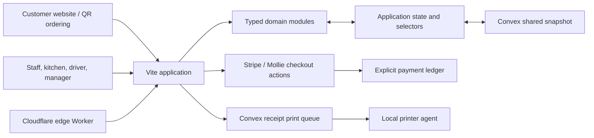

# LibaBite Restaurant Operations Prototype

[](https://github.com/AliKhairreddin/libabite-all-in-one-system/actions/workflows/deploy.yml)

LibaBite is a full-stack prototype for connecting restaurant ordering, kitchen execution, inventory, reservations, delivery, staff workflows, payments, and reporting in one operational system.

- **Customer surface:** [libabite-order.thatcanadian.dev](https://libabite-order.thatcanadian.dev)
- **Staff surface:** [libabite-work.thatcanadian.dev](https://libabite-work.thatcanadian.dev)

The apex domain `thatcanadian.dev` is intentionally not attached to this project. Keep it available for a separate site; Libabite deployments should use only the two subdomains above.

> **Status:** Functional prototype, not a production POS. Domain workflows, cloud sync, checkout plumbing, receipt queues, and deployment are implemented; production authentication, live payment credentials, external marketplace approvals, and physical printer validation still require operational rollout work.

## Product Scope

The project models the restaurant as one connected workflow rather than a collection of isolated screens:

- website, QR, takeaway, delivery, and dine-in order entry;
- kitchen tickets, station-specific views, preparation progress, and waiter handoff;
- products, recipes, ingredients, locations, inventory movements, waste, and supplier reorders;
- reservations, blocked windows, table conflicts, floor-plan selection, and seating recommendations;
- customer history, favorites, addresses, delivery assignment, and route progress;
- staff roles, permissions, shifts, punches, procedures, and operational reporting;
- explicit payment records, provider references, refunds, deposits, and order-level display state;
- receipt generation plus queued local-network printing.

## Architecture



## Engineering Highlights

### Shared State Without Cross-Device Session Collisions

Restaurant data is synced through Convex, while browser-specific state—current login, filters, carts, and in-progress drafts—remains local. This prevents one device from taking over another device's active workspace.

When Convex is not configured, the prototype can run from browser storage for local evaluation. The top-bar sync indicator exposes connecting, saving, synced, and error states.

### Domain Logic Outside the UI

Payments, orders, reservations, inventory, recipes, scheduling, scanning, delivery, customers, and suppliers live in reusable TypeScript modules under `src/domain`. UI renderers call domain helpers instead of duplicating business rules in event handlers.

### Explicit Payment Ledger

Orders and reservations retain convenient display fields, but provider identifiers, checkout sessions, terminal references, refund timestamps, and deposits are modeled as payment records. This keeps payment history separate from mutable order presentation.

### Queue-Based Receipt Printing

The browser creates a print job in Convex. A local Node.js agent claims jobs and sends rendered receipts to a network printer, avoiding browser print dialogs and keeping hardware access off the public web surface. A dry-run mode validates queue behavior without contacting a printer.

### Role-Aware Workspaces

The application maps staff roles to relevant views and actions. The current prototype demonstrates the workflow, but the role model is not a substitute for production-grade identity and authorization enforcement.

### Regression Coverage

The domain suite currently contains 28 tests covering payment normalization, VAT/allergen metadata, staff permissions, order totals, kitchen transitions, receipt generation, external imports, scanning, delivery progress, reservations, shifts, inventory, suppliers, recipes, production cost, and margin helpers.

## Technology

| Layer | Technologies |
| --- | --- |
| Application | TypeScript, Vite, React migration surface |
| UI | Tailwind CSS, shadcn/ui primitives, Leaflet |
| Domain | Framework-independent TypeScript modules |
| State | Convex shared snapshot plus browser-local session state |
| Payments | Stripe Checkout/iDEAL flow, Mollie-ready actions |
| Edge | Cloudflare Pages and Workers |
| Delivery | GitHub Actions, Wrangler |

## Repository Layout

```text
src/domain/             Business rules for orders, inventory, payments, staff, etc.
src/app/                Runtime wiring, actions, selectors, sync, and event handling
src/ui/                 Screen renderers for operational workspaces
src/data/               Seed/normalization/storage helpers
src/shared/             Types, IDs, money, dates, QR, and formatting helpers
src/react/              React migration entry point
convex/                 Shared state, payments, sync log, and print jobs
scripts/                Local receipt printer agent
tests/                  Domain regression suite
worker/                 Edge health checks and short redirects
```

## Local Development

```bash
npm install
cp .env.example .env.local
npm run convex:dev
npm run dev
```

Relevant client configuration:

```text
VITE_CONVEX_URL=https://your-deployment.convex.cloud
VITE_CONVEX_STATE_KEY=libabite-main
VITE_CUSTOMER_SITE_URL=https://libabite-order.thatcanadian.dev
VITE_STAFF_APP_URL=https://libabite-work.thatcanadian.dev
```

Without `VITE_CONVEX_URL`, the app stays in browser-local prototype mode.

## Payments

Website checkout is implemented through Convex actions. Configure backend secrets interactively rather than committing them:

```bash
npx convex env set STRIPE_SECRET_KEY
```

The Stripe path supports card and iDEAL configuration for the Netherlands and verifies successful returns before marking an order paid. Mollie actions remain inactive until a Mollie API key is configured.

This repository does not claim live transaction volume; checkout must be validated with the intended provider account before production use.

## Receipt Printer Agent

```bash
CONVEX_URL=https://your-deployment.convex.cloud \
CONVEX_STATE_KEY=libabite-main \
RECEIPT_PRINTER_HOST=192.168.1.50 \
RECEIPT_PRINTER_PORT=9100 \
npm run printer:agent
```

Validate without printer hardware:

```bash
RECEIPT_DRY_RUN=true npm run printer:agent -- --once
```

## External Delivery

Uber Eats and Just Eat Takeaway/Thuisbezorgd are modeled as marketplace-owned payment channels, but live API access requires provider approval and credentials. Until then, the external-delivery workspace supports manual, email, CSV, and staff-entered imports.

Prepared configuration includes:

- Uber Eats client/store identifiers;
- Just Eat Takeaway connection/location identifiers;
- webhook and adapter metadata;
- commission separation from direct restaurant payments.

## Verification

```bash
npm run check
npm test
npm run build
```

- `check` validates the main TypeScript project.
- `test` compiles the domain project and runs 28 Node tests.
- `build` performs a production Vite build after TypeScript validation.

## Deployment

The deployment workflow runs on pushes to `main`:

1. deploy Convex functions;
2. deploy the `libabite-edge` Worker;
3. build and publish the Pages application.

The Worker provides `/health`, `/staff`, `/order`, and `/reserve` routes. Hostname-aware application startup sends the customer domain to the public ordering entry and the staff domain to the internal workspace.

Cloudflare Pages domain assignments:

- `libabite-order.thatcanadian.dev` routes customers to public ordering;
- `libabite-work.thatcanadian.dev` routes staff to the internal workspace;
- `libabite.pages.dev` remains the Cloudflare-provided project hostname;
- `thatcanadian.dev` and `app.thatcanadian.dev` must not be assigned to Libabite.

## Production Readiness Gaps

Before treating this as a real restaurant operating system:

- replace prototype login state with secure server-enforced identity and authorization;
- validate Stripe/Mollie webhooks, refunds, and failure recovery with live provider accounts;
- test the printer agent against the exact receipt printer and network environment;
- complete marketplace certification and webhook verification;
- define backups, audit retention, monitoring, incident response, and offline behavior;
- remove seed/demo data and complete an operational acceptance test with restaurant staff.
