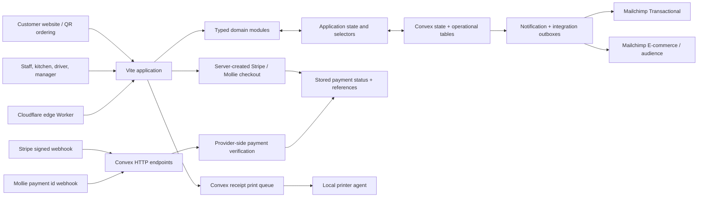

# LibaBite Restaurant Operations Prototype

[](https://github.com/AliKhairreddin/libabite-all-in-one-system/actions/workflows/deploy.yml)

LibaBite is a full-stack prototype for connecting restaurant ordering, kitchen execution, inventory, reservations, delivery, staff workflows, payments, and reporting in one operational system.

- **Customer surface:** [libabite-order.thatcanadian.dev](https://libabite-order.thatcanadian.dev)
- **Staff surface:** [libabite-work.thatcanadian.dev](https://libabite-work.thatcanadian.dev)

> **Status:** Functional prototype, not a production POS. Domain workflows, cloud sync, signed Stripe webhook handling, Mollie server verification, communication outboxes, receipt queues, and deployment plumbing are implemented. Live payment/webhook recovery, provider-backed email delivery, production authentication, marketplace approvals, and physical printer behavior still require end-to-end operational validation.

See the [production-readiness audit](docs/production-readiness-audit.md) for the prioritized rollout and risk register.

## Product Scope

The project models the restaurant as one connected workflow rather than a collection of isolated screens:

- website, QR, takeaway, delivery, and dine-in order entry;
- kitchen tickets, station-specific views, preparation progress, and waiter handoff;
- products, recipes, ingredients, locations, inventory movements, waste, and supplier reorders;
- reservations, blocked windows, table conflicts, floor-plan selection, and seating recommendations;
- customer history, favorites, addresses, delivery assignment, and route progress;
- staff roles, permissions, shifts, punches, procedures, and operational reporting;
- explicit payment records, provider references, refunds, deposits, and order-level display state;
- deduplicated order/reservation email outbox jobs, Mailchimp E-commerce contact sync, and explicit marketing consent;
- receipt generation plus queued local-network printing.

## Architecture



## Engineering Highlights

### Shared State Without Cross-Device Session Collisions

Restaurant data is synced through Convex, while browser-specific state—current login, filters, carts, and in-progress drafts—remains local. This prevents one device from taking over another device's active workspace.

When Convex is not configured, the prototype can run from browser storage for local evaluation. The top-bar sync indicator exposes connecting, saving, synced, and error states.

### Domain Logic Outside the UI

Payments, orders, reservations, inventory, recipes, scheduling, scanning, delivery, customers, and suppliers live in reusable TypeScript modules under `src/domain`. UI renderers call domain helpers instead of duplicating business rules in event handlers.

### Explicit Payment Ledger

Orders and reservations retain convenient display fields, but provider identifiers, checkout sessions, terminal references, refund timestamps, and deposits are modeled as payment records. This keeps payment history separate from mutable order presentation.

Checkout return URLs are generated on the server from `CUSTOMER_SITE_URL`. Stripe webhook signatures are checked before processing, while Mollie webhook payment IDs are verified by retrieving current payment state from Mollie with the server API key. Provider events and fulfillment transitions are idempotent.

### Transactional Communications and Consent

Trusted server-side order and reservation lifecycle events create deduplicated Convex outbox jobs. One-to-one receipts, confirmations, status updates, and reservation messages use Mailchimp Transactional; API or delivery failures never roll back the underlying order, payment, or reservation. Provider delivery is at least once rather than exactly once: an ambiguous timeout after provider acceptance can cause a duplicate, so messages and operations must remain duplicate-tolerant.

Whenever a trusted server command queues an order/reservation contact, that email is upserted as a Mailchimp E-commerce store customer with `opt_in_status: false`, making it a transactional/non-subscribed contact rather than a marketing subscriber. The public checkbox is separate, optional, and unticked. Only a stored strict Boolean opt-in advances the linked audience member to `pending` for Mailchimp double opt-in; this system never marks someone directly subscribed.

### Queue-Based Receipt Printing

The browser creates a print job in Convex. A local Node.js agent claims jobs and sends rendered receipts to a network printer, avoiding browser print dialogs and keeping hardware access off the public web surface. A dry-run mode validates queue behavior without contacting a printer.

### Role-Aware Workspaces

The application maps staff roles to relevant views and actions. The current prototype demonstrates the workflow, but the role model is not a substitute for production-grade identity and authorization enforcement.

### Regression Coverage

The regression suite covers payment and webhook helpers, communication consent and idempotency, immutable order snapshots, VAT/allergen metadata, staff permissions, kitchen transitions, receipt generation, external imports, scanning, delivery progress, reservations, shifts, inventory, suppliers, recipes, production cost, and margin helpers. Use `npm test` for the current test count.

## Technology

| Layer | Technologies |
| --- | --- |
| Application | TypeScript, Vite, React migration surface |
| UI | Tailwind CSS, shadcn/ui primitives, Leaflet |
| Domain | Framework-independent TypeScript modules |
| State | Convex shared snapshot plus browser-local session state |
| Payments | Stripe Checkout/iDEAL, signed Stripe webhooks, Mollie verification |
| Communications | Convex outboxes, Mailchimp Transactional and Marketing E-commerce APIs |
| Edge | Cloudflare Pages and Workers |
| Delivery | GitHub Actions, Wrangler |

## Repository Layout

```text
src/domain/             Business rules for orders, inventory, payments, staff, etc.
src/app/                Runtime wiring, actions, selectors, sync, and event handling
src/ui/                 Screen renderers for operational workspaces
src/data/               Seed/normalization/storage helpers
src/shared/             Types, IDs, money, dates, QR, and formatting helpers
src/react/              React migration entry point
convex/                 Shared state, payments/webhooks, communication outboxes, sync log, and print jobs
scripts/                Local receipt printer agent
tests/                  Domain regression suite
worker/                 Edge health checks and short redirects
```

## Local Development

```bash
npm install
cp .env.example .env.local
npm run convex:dev
npm run dev
```

Relevant client configuration:

```text
VITE_CONVEX_URL=https://your-deployment.convex.cloud
VITE_CONVEX_STATE_KEY=libabite-main
VITE_CUSTOMER_SITE_URL=https://libabite-order.thatcanadian.dev
VITE_STAFF_APP_URL=https://libabite-work.thatcanadian.dev
VITE_ONLINE_PAYMENT_PROVIDERS=stripe
```

Without `VITE_CONVEX_URL`, the app stays in browser-local prototype mode.

Only browser-safe configuration belongs in `VITE_*` variables. Stripe, Mollie, Mailchimp, marketplace, and webhook credentials must be stored in the Convex deployment environment; never expose provider secrets through Vite.

## Payments

Website checkout is created from stored server-side order data. The browser supplies an order ID, not prices, recipient details, return URLs, or provider credentials. Configure backend values in Convex rather than committing them:

```bash
npx convex env set STRIPE_SECRET_KEY
npx convex env set STRIPE_WEBHOOK_SECRET
npx convex env set CUSTOMER_SITE_URL https://libabite-order.thatcanadian.dev

# Optional: omit this to leave Mollie disabled.
npx convex env set MOLLIE_API_KEY
```

`CUSTOMER_SITE_URL` is the allowlisted origin used to generate success and cancellation URLs on the server. In production it should remain `https://libabite-order.thatcanadian.dev`; it must not point to the staff or apex domain.

Convex automatically provides `CONVEX_SITE_URL` to functions for the deployment's HTTP-action origin; it is not an application secret that needs to be copied into `.env`. Mollie checkout uses that system value to construct its callback URL. See [Convex system environment variables](https://docs.convex.dev/production/environment-variables#system-environment-variables).

Configure provider callbacks against the Convex HTTP origin (`https://<deployment>.convex.site`):

- Stripe: `POST /payments/stripe/webhook`. Register the full URL in Stripe, subscribe to `checkout.session.completed`, `checkout.session.async_payment_succeeded`, `checkout.session.async_payment_failed`, and `checkout.session.expired`, and store the endpoint signing secret in `STRIPE_WEBHOOK_SECRET`. The raw request is verified with the `Stripe-Signature` header before the session is retrieved and applied.
- Mollie: `POST /payments/mollie/webhook`. Checkout creation supplies this URL when Convex exposes `CONVEX_SITE_URL`. Mollie posts a payment ID; the endpoint does not trust that payload as payment proof and retrieves the current payment from Mollie with `MOLLIE_API_KEY` before fulfillment.

Stripe supports card and iDEAL configuration for the Netherlands. `VITE_ONLINE_PAYMENT_PROVIDERS` controls which configured choices the browser shows; it defaults to `stripe`, and Mollie should only be added after `MOLLIE_API_KEY` and its webhook have been tested. Browser returns can improve customer experience, but webhook/provider verification is the authoritative payment path.

These endpoints and validation rules are implemented, but live provider registration, retry/reordering behavior, refund recovery, and end-to-end settlement have not yet been verified with the intended production accounts.

## Email and Mailchimp Setup

Communications run from Convex and require server-only credentials:

```bash
npx convex env set TRANSACTIONAL_EMAIL_PROVIDER mailchimp_transactional
npx convex env set MAILCHIMP_TRANSACTIONAL_API_KEY
npx convex env set MAILCHIMP_TRANSACTIONAL_FROM_EMAIL orders@libabite-order.thatcanadian.dev
npx convex env set MAILCHIMP_TRANSACTIONAL_FROM_NAME Libabite

npx convex env set MAILCHIMP_MARKETING_API_KEY
npx convex env set MAILCHIMP_MARKETING_AUDIENCE_ID
npx convex env set MAILCHIMP_MARKETING_STORE_ID
```

Required email values are `MAILCHIMP_TRANSACTIONAL_API_KEY`, `MAILCHIMP_TRANSACTIONAL_FROM_EMAIL`, `MAILCHIMP_MARKETING_API_KEY`, `MAILCHIMP_MARKETING_AUDIENCE_ID`, and `MAILCHIMP_MARKETING_STORE_ID`. `TRANSACTIONAL_EMAIL_PROVIDER` is optional and currently defaults to `mailchimp_transactional`; `MAILCHIMP_TRANSACTIONAL_FROM_NAME`, `MAILCHIMP_TRANSACTIONAL_REPLY_TO`, and `MAILCHIMP_MARKETING_SERVER_PREFIX` are also optional. The Marketing server prefix, such as `us21`, is normally derived from the API-key suffix.

Before enabling the workers:

1. Enable Mailchimp Transactional for the account and authenticate the sending domain used by `MAILCHIMP_TRANSACTIONAL_FROM_EMAIL` (including Mailchimp's required domain verification/DKIM records and the site's SPF/DMARC policy).
2. Create the Marketing audience, then create or identify a Mailchimp E-commerce store linked to that same audience. Set its existing IDs as `MAILCHIMP_MARKETING_AUDIENCE_ID` and `MAILCHIMP_MARKETING_STORE_ID`; the adapter upserts customers but does not create or relink the store.
3. Confirm that public order and reservation forms retain separate, unticked marketing checkboxes. Transactional messages do not depend on that checkbox.
4. Exercise request, confirmation, cancellation, bounce, retry, unsubscribe, and double-opt-in paths with test recipients before production traffic.

The internal integration first performs the E-commerce customer PUT as a transactional/non-subscribed contact. When—and only when—the stored consent flag is literal `true`, it separately sets the linked audience member to `pending`, allowing Mailchimp's double-opt-in flow; an active or completed opt-in job is not restarted on every later order. One-to-one operational emails use Mailchimp Transactional, not a Marketing campaign.

Provider-verified order payment confirmations and failures can queue this internal outbox now. Browser snapshot writes are deliberately not allowed to invoke it: order-received and reservation lifecycle messages/contact sync must be activated from the authenticated, atomic server commands described in the production-readiness audit. This prevents the current anonymous snapshot architecture from becoming an open email relay.

The outbox/retry logic and provider adapters are implemented, but a provider-accepted status is not proof of inbox delivery. Sending-domain authentication, bounce behavior, Mailchimp store/audience linkage, and live-email end-to-end delivery remain unverified until configured against the production account.

## Receipt Printer Agent

```bash
CONVEX_URL=https://your-deployment.convex.cloud \
CONVEX_STATE_KEY=libabite-main \
RECEIPT_PRINTER_HOST=192.168.1.50 \
RECEIPT_PRINTER_PORT=9100 \
npm run printer:agent
```

Validate without printer hardware:

```bash
RECEIPT_DRY_RUN=true npm run printer:agent -- --once
```

## External Delivery

Uber Eats and Just Eat Takeaway/Thuisbezorgd are modeled as marketplace-owned payment channels, but live API access requires provider approval and credentials. Until then, the external-delivery workspace supports manual, email, CSV, and staff-entered imports.

Prepared configuration includes:

- Uber Eats client/store identifiers;
- Just Eat Takeaway connection/location identifiers;
- webhook and adapter metadata;
- commission separation from direct restaurant payments.

## Verification

```bash
npm run check
npm test
npm run build
```

- `check` validates the main TypeScript project.
- `test` compiles the domain project and runs the current Node regression suite.
- `build` performs a production Vite build after TypeScript validation.

## Deployment

The deployment workflow runs on pushes to `main`. It installs from the lockfile, type-checks, runs the regression suite, audits production dependencies, and completes the production frontend build before any deployment starts. It then:

1. deploy Convex functions;
2. deploy the `libabite-edge` Worker;
3. publish the already-validated Pages build.

The Worker provides `/health`, `/staff`, `/order`, and `/reserve` routes. Hostname-aware application startup sends the customer domain to the public ordering entry and the staff domain to the internal workspace.

Cloudflare Pages domain assignments:

- `libabite-order.thatcanadian.dev` routes customers to public ordering;
- `libabite-work.thatcanadian.dev` routes staff to the internal workspace;
- `libabite.pages.dev` remains the Cloudflare-provided project hostname.

## Production Readiness Gaps

Before treating this as a real restaurant operating system:

- replace prototype login state with secure server-enforced identity and authorization;
- validate Stripe/Mollie webhooks, refunds, and failure recovery with live provider accounts;
- validate Mailchimp sending-domain authentication, E-commerce linkage, double opt-in, bounces, and live inbox delivery;
- test the printer agent against the exact receipt printer and network environment;
- complete marketplace certification and webhook verification;
- define backups, audit retention, monitoring, incident response, and offline behavior;
- remove seed/demo data and complete an operational acceptance test with restaurant staff.
